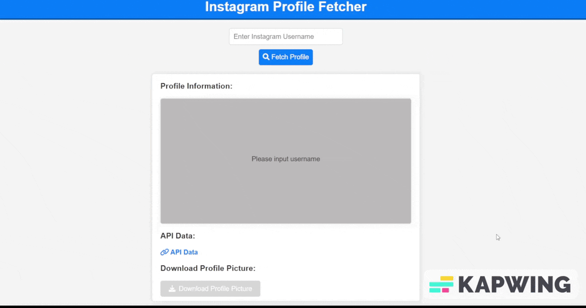

# Instagram Profile Fetcher
The Instagram Profile API

## Quick Documentation 


### Response Example
> response for `@kohaku_shinba`
```json5
{
    "status": "Ok",
    "data": [
        {
            "name": "Kohaku Shinba",
            "username": "@kohaku_shinba",
            "description": "0 Followers, 97 Following, 0 Posts",
            "url_name": "https://www.instagram.com/kohaku_shinba/",
            "profilePicUrl": "https://scontent-iad3-2.cdninstagram.com/v/t51.2885-19/411045448_371667905351554_5912171042667720778_n.jpg?stp=dst-jpg_p100x100&_nc_cat=105&ccb=1-7&_nc_sid=fcb8ef&_nc_ohc=7pGqxO_gbiwQ7kNvgFVwajc&_nc_ht=scontent-iad3-2.cdninstagram.com&oh=00_AYA9xxntHCmFB7kjsbY94-Eoi8yH7g9dcQAm-kRnQ1zQbw&oe=66BC23F8"
        }
    ]
}
```

#### Installation & Configuration
> note: run the command without the `$` symbol

- Open up your terminal, then run this command to clone this repo
```bash
$ git clone https://github.com/NPMA7/instagram-profile-fetcher.git.
```

- Then cd into the project root directory 
```bash
$ cd instagram-profile-fetcher-main
```

- Inside the project root directory, run this command to install all the dependencies
```bash
$ npm install
``` 

- To run a development server, run
```bash
$ npm run start
```
- The server accessible from a browser on `http://localhost:3333`
